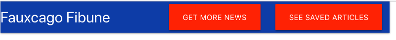
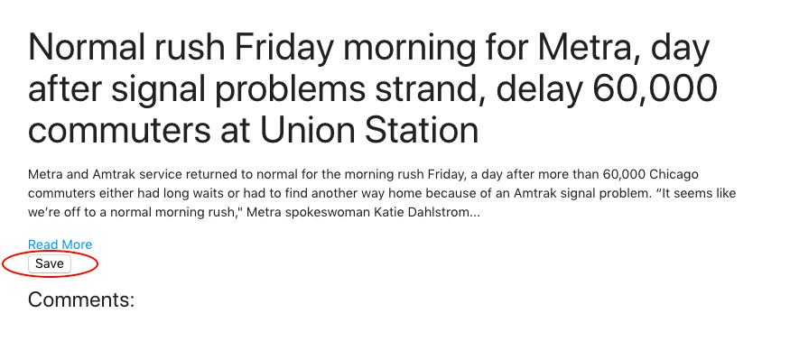
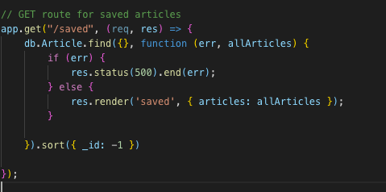

# Fauxcago Fibune
### a scraped Chicago Tribune

[Fauxcago Fibune](#) is a data-persistient,full stack  NoSQL  application utilizing an MVC architecture and CRUD functionalities. 

## CRUD 

The Fibune performs all of the basic functions of persistient storage. 

*  Creates data when users select the 'Get More News' button which scrapes the Chicago Tribune for headlines, urls, and summaries of stories and puts it into an object. Then using that object adds it to a collection defined in a Mongoose model. 

Data can be refreshed by clicking the same button, and will reflect the latest news on the Tribune's website. 

*  Reads the data from that databse and renders it on screen. 

*  Updates data in two ways: If a user clicks "save" on the "/articles" page a boolean value of saved will be changed from "false" to "true".

Displayed on the "/saved" page

Using the sort method in Mongoose. 

 The articles with a value of "saved = true" are then filtered through the Handlebars view engine using built in helpers and displayed. 
 
 * Deletes data when a user clicks "delete" in the "/saved" page which changes the "saved" value of that document from "false" back to "true". 

## Comments 
At present, this application does not display the comments, but will display the associated ID from the comments tabe. The basic functionality is there, but 

## Technologies Used
* [axios](https://github.com/axios/axios)
* [Cheerio](https://github.com/cheeriojs/cheerio)
* [Express](https://expressjs.com/)
* [Materialize CSS](https://materializecss.com/)
* [MongoDB](https://www.mongodb.com/)
* [Mongoose](https://mongoosejs.com/)
* [Node](https://nodejs.org/en/)

